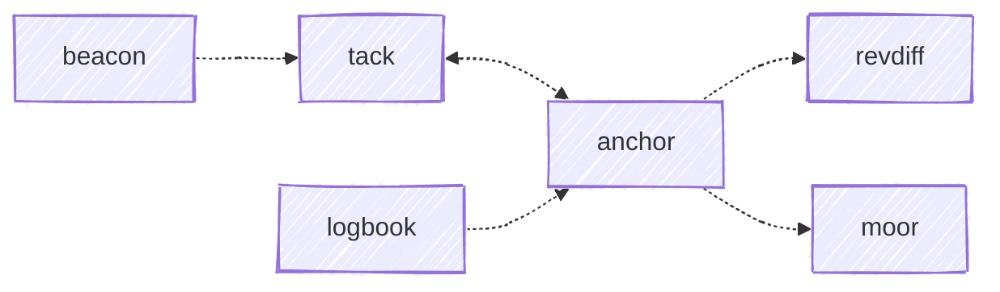

# The bridge.ai suite

**bridge.ai** ([bridgeai.codes](http://bridgeai.codes)) is the entrypoint to a set
of Claude Code plugins for AI-assisted development. This repo is that entrypoint:
it owns the roster, how each plugin is presented, and the documentation about how
they fit together. Each plugin lives in its own repo and ships on its own.

This is the document for the two questions a per-plugin doc site can't answer:
**which of these should I install?** and **why separate plugins rather than one?**

Separate, because you shouldn't have to take the whole thing. Each plugin
installs, versions, and releases on its own, so you can run the two that suit any
workflow and skip the ones built for a way of working that isn't yours. That's
also what makes the tiers below mean anything — a recommendation is only useful
when declining it is cheap.

## Two axes

Every plugin has a **capability group** (what it does) and an **adoption tier**
(how strongly it's recommended). The two are independent, and the interesting
cases are where they disagree — `anchor` and `moor` do adjacent work at opposite
ends of the recommendation scale.

|  | Stay safe | Keep oriented | Reach your waypoints | Write it down |
|---|---|---|---|---|
| **Start here** | ClaudeWatch, shipshape | | | |
| **Recommended** | | | anchor | |
| **Proving out** | | beacon, tack | | |
| **Focused** | | | | cleat, sextant |
| **Reference** | | | moor | logbook |

A group is declared by the plugin, in its own `plugin.yml`. A tier is declared
here, in [`suite/tiers.yml`](suite/tiers.yml), because a tier ranks a plugin
against its siblings and moves as the suite matures.

**Start here** if you're new: `ClaudeWatch` and `shipshape` conflict with no
workflow. Add `anchor` if you want the git and forge side handled consistently.

## What each plugin owns

The boundaries matter more than the feature lists, because the plugins grew
independently and several sit next to each other.

| Plugin | Owns | Hands off |
|---|---|---|
| **ClaudeWatch** | The decision to auto-approve, ask, or block a tool call, before it runs | Everything after the call is allowed |
| **shipshape** | The harness's own health — Claude Code's version, which plugins are installed, cache hygiene | Anything inside your project |
| **anchor** | The shape of the permanent record: commits, change requests, issues, reviews, releases, each led by *why* | Reading the diff (to a diff viewer) and knowing which work a CR belongs to (to `tack`) |
| **tack** | Continuity across sessions — routes, pivots, and the deliverables a piece of work produced | Producing the forge artifacts (`anchor`) and displaying state (`beacon`) |
| **beacon** | Ambient visibility of what every open session is doing right now | The durable work label, when a `tack` route is driving the session |
| **cleat** | The shape of a repo's agent instructions, so every AI tool reads the same file | The content of that guidance |
| **sextant** | Requirements as the source of truth — a `SPEC.md` contract, its coverage, and drift against the code | The commit and review flow (`anchor`) |
| **logbook** | Publishing a session retro to a team repo | — |
| **moor** | Stepping through a two-path diff and sending each rejection back | — |

The `beacon` / `tack` boundary is the one that needed a rule to settle, and it's
worth knowing if you run both: when a `tack` route is bound to the session, tack
supplies the label and beacon leaves it alone. Beacon owns the *surface*; tack
owns the *content* whenever it has an opinion.

## How they connect

Every edge is **optional**, and every plugin works standalone. Edges are declared
by the depending plugin in its own `plugin.yml` (`suite.dependencies`) and never
discovered, so adding one is a deliberate act.

`ClaudeWatch`, `shipshape`, `cleat`, and `sextant` declare nothing and are
depended on by nothing — they compose with anything.

`anchor` and `tack` point at each other: anchor records a CR against a route, and
tack's session close reports the anchor commands still owed. Both directions
degrade quietly when the other isn't installed.

Two edges reach plugins you shouldn't install. `anchor` prefers
[revdiff](https://revdiff.com) as its diff-review backend and falls back to
`moor`; `tack` reports a deferred-note count from `logbook`. Skipping the
Reference-tier plugins costs you those two conveniences and nothing else.

## Where things live

| Repo | Owns |
|---|---|
| the plugin's own repo | its code and its descriptor — `plugin.yml`, skills, rules, hooks. Everything shown *about* a plugin is declared here |
| **claude-marketplace** (this repo) | the roster, both curation axes, the published entrypoint, and this documentation |
| [**shipyard**](https://github.com/chris-peterson/shipyard) | the projection tooling and CI practices that keep the plugins consistent with each other |

The dividing line: a plugin declares what it *is*, bridge.ai decides what the
*set* looks like, and shipyard supplies the machinery that turns declarations into
generated artifacts. Nothing about a plugin is restated here — the catalog is
projected from the plugins' own descriptors on every build, so the two can't
drift.

bridge.ai currently runs its own generators under [`suite/`](suite/README.md)
rather than shipyard's aggregator commands. Converging them needs `plugins.yml` to
carry the aggregator's per-plugin curation, which it doesn't yet.

## Planning

- **This repo** — anything user-facing: the roster, tiers, plugin boundaries, the
  landing page, and work that spans more than one plugin.
- **A plugin's repo** — work inside one plugin. That's where its code, changelog,
  and release tag live, so that's where the issue belongs.
- **shipyard** — build tooling, projection, and cross-plugin consistency.

Suite-level decisions are recorded as issues here, labeled per plugin, linking out
to the plugin repos for execution.
