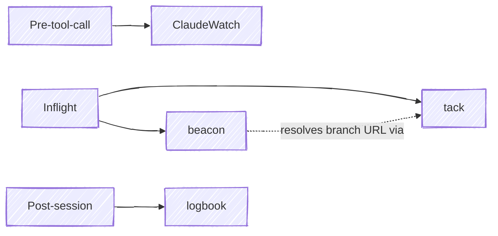

# How the plugins fit together

The four plugins in this marketplace cover distinct stages of a Claude Code session — safety, work tracking, awareness, and knowledge capture. Each is independently useful; together they form a workflow stack.

## Roles by lifecycle stage

| Plugin | Stage | Role |
|---|---|---|
| ClaudeWatch | Pre-tool-call | Gate Bash / Edit / Write against a deny/ask rule set |
| tack | Inflight | Track routes, pivots, and linked deliverables across sessions |
| beacon | Inflight | Paint iTerm2 badge + status bar so session state is glanceable |
| logbook | Post-session | Sanitize the transcript into a retrospective committed to a team git repo |

## Diagram

## How they interact

- **ClaudeWatch** is independent. It runs as a `PreToolUse` hook and never reads from the other plugins.
- **tack** maintains per-route state on disk (routes, tacks, links to MRs / PRs / pipelines). Other tools may read it, but tack itself has no dependencies on the rest.
- **beacon** is the one plugin with a soft dependency on another: when the iTerm2 status bar's `↗` button is clicked, beacon shells out to `tack` (if on `$PATH` and the route matches the current branch) to resolve the branch's CR/PR/issue URL. If `tack` is absent or has no match, beacon falls back to a plain branch URL or the project URL.
- **logbook** captures the session transcript after the fact and publishes a sanitized retro to a team-owned git repository. It's decoupled from the inflight plugins.

The only inter-plugin dependency is **beacon → tack**, and it is optional.
