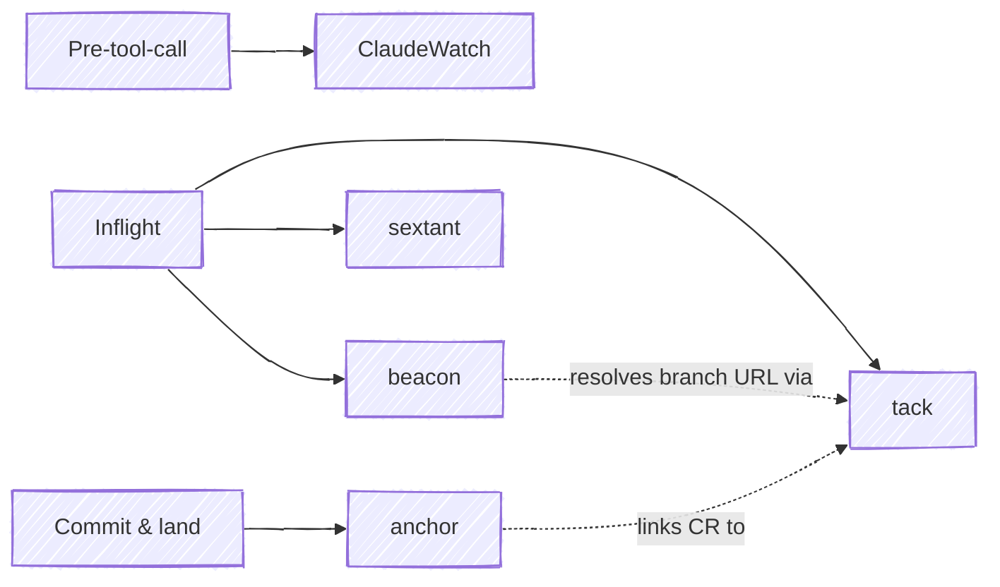

# How the plugins fit together

The plugins in this marketplace cover distinct stages of a Claude Code session — safety, work tracking, awareness, spec-driven authoring, and landing the change. Each is independently useful; together they form a workflow stack.

## Roles by lifecycle stage

| Plugin | Stage | Role |
|---|---|---|
| ClaudeWatch | Pre-tool-call | Gate Bash / Edit / Write against a deny/ask rule set |
| tack | Inflight | Track routes, pivots, and linked deliverables across sessions |
| beacon | Inflight | Paint iTerm2 badge + status bar so session state is glanceable |
| sextant | Inflight | Audit `SPEC.md` coverage, scaffold candidate implementations, and graduate the winner |
| anchor | Commit & land | Commit with a why-first message, review the diff hunk by hunk, and open/describe the CR on the forge |

## Diagram

```mermaid
%%{ init: { 'look': 'handDrawn' } }%%
flowchart LR
    Pre[Pre-tool-call] --> CW[ClaudeWatch]
    Inflight[Inflight] --> Tack[tack]
    Inflight --> Beacon[beacon]
    Inflight --> Sextant[sextant]
    Land[Commit & land] --> Anchor[anchor]

    Beacon -. resolves branch URL via .-> Tack
    Anchor -. links CR to .-> Tack
```

## How they interact

- **ClaudeWatch** is independent. It runs as a `PreToolUse` hook and never reads from the other plugins.
- **tack** maintains per-route state on disk (routes, tacks, links to MRs / PRs / pipelines). Other tools may read it, but tack itself has no dependencies on the rest.
- **beacon** is the one plugin with a soft dependency on another: when the iTerm2 status bar's `↗` button is clicked, beacon shells out to `tack` (if on `$PATH` and the route matches the current branch) to resolve the branch's CR/PR/issue URL. If `tack` is absent or has no match, beacon falls back to a plain branch URL or the project URL.
- **sextant** operates against `SPEC.md` and the `implementations/` tree in your repo. It reads requirement IDs and implementation status, and on `impl-new` / `impl-select` writes directly to those trees. Independent of the other plugins.
- **anchor** drives reviewed work into the permanent record: it commits with a why-first message, walks the diff hunk by hunk, and opens/describes the change request on the forge. Its **tack** integration is soft: when `tack` is present and a route matches, it records the CR as that route's deliverable; without it the CR still lands, unlinked.

Inter-plugin dependencies are all optional: **beacon → tack** (URL resolution) and **anchor → tack** (CR linking). Every plugin also works standalone.
